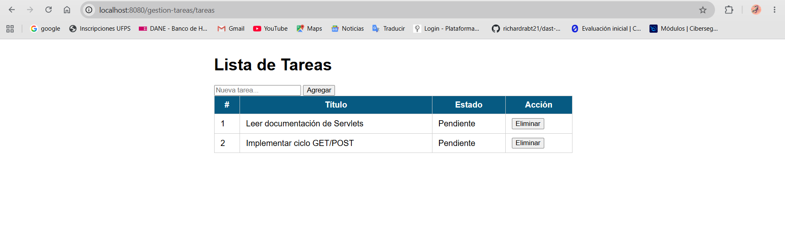
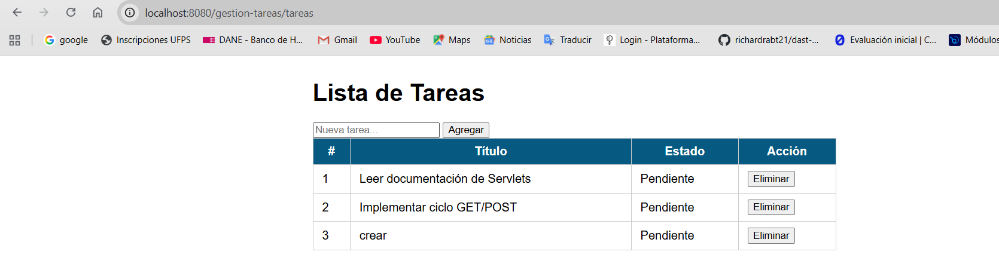
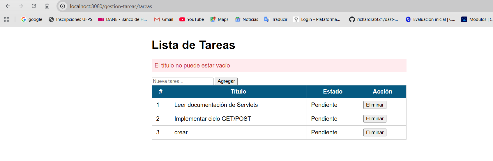
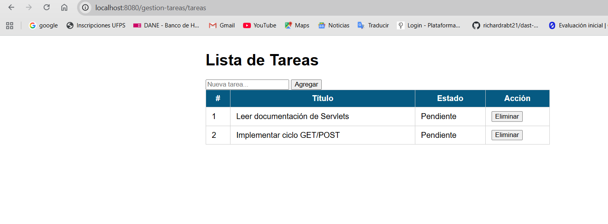
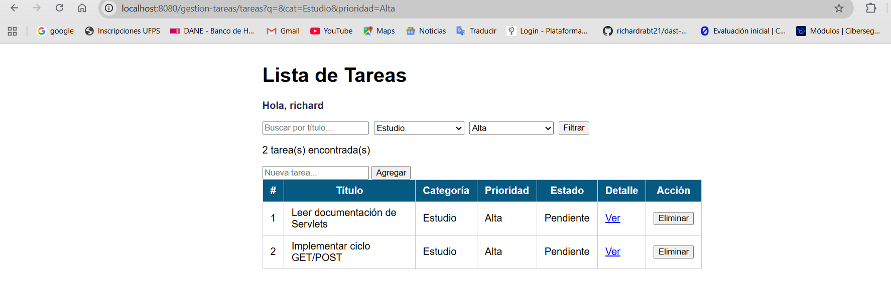
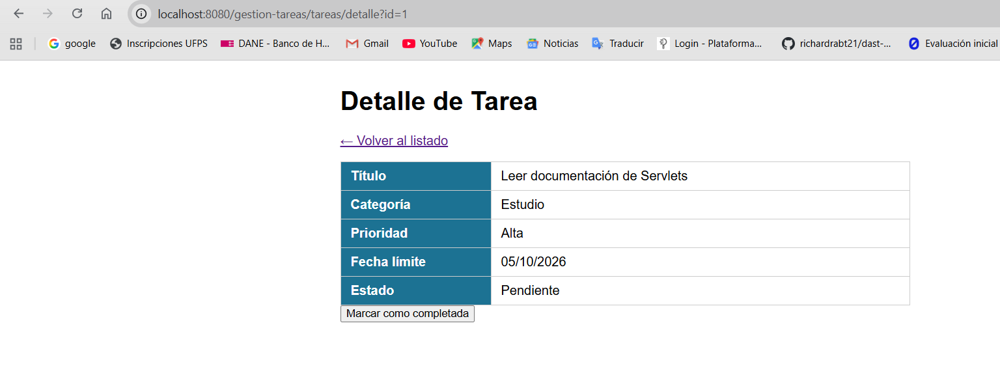

# Post-contenido — Unidad 5: Fundamentos de Java Web (Servlets y JSP)

## Descripción

Repositorio del laboratorio de la Unidad 5 de Programación Web.
Un único proyecto Maven Web (`gestion-tareas`) con dos partes que extienden
el mismo dominio de tareas: la Parte 1 construye el Servlet base con el ciclo
GET/POST y el patrón Post/Redirect/Get; la Parte 2 le agrega filtrado
combinado, vista de detalle con un segundo Servlet, y sesión para
personalización y persistencia del filtro.

## Parte 1 — Servlet de gestión de tareas

`TareasServlet` procesa peticiones GET (listar) y POST (agregar, eliminar),
con validación en el servidor y el patrón Post/Redirect/Get para evitar el
reenvío de formularios.

## Parte 2 — Filtros, detalle y sesión

`TareasServlet` se extiende con filtrado combinado por texto, categoría y
prioridad, y con las acciones completar e identificar. Se agrega
`DetalleTareaServlet`, que lee la misma lista de tareas desde
`applicationScope` y hace forward a una vista de detalle. `HttpSession`
guarda el nombre del usuario identificado y el último filtro aplicado.

## Decisiones de diseño

- La lista de tareas es una variable de instancia porque es estado
  compartido de toda la aplicación, no un dato de una petición individual
  (ver comentario en `TareasServlet`).
- El filtro activo y el nombre del usuario se guardan en `HttpSession`, no en
  el request, porque deben sobrevivir a varias peticiones distintas
  (navegación entre `/tareas` y `/tareas/detalle`).
- `DetalleTareaServlet` obtiene las tareas desde el `ServletContext`
  (`applicationScope`) en vez de duplicar la lista, y usa forward en lugar de
  redirect porque solo necesita entregar un objeto ya calculado a una vista,
  sin generar una nueva petición del navegador.
- Los estilos se extrajeron a `css/estilos.css` al agregar una segunda vista
  (`detalle.jsp`), para no duplicar el bloque `<style>` de la Parte 1 en cada
  JSP.
- `TareasServlet` se declara con `loadOnStartup = 1` para que Tomcat lo
  inicialice al arrancar la aplicación. Así la lista ya está publicada en
  `applicationScope` aunque la primera petición sea a `/tareas/detalle`.
- Las vistas usan los URI de JSTL 3.0 (`jakarta.tags.core`, `jakarta.tags.fmt`,
  `jakarta.tags.functions`), porque con Jakarta EE 10 y Tomcat 10.1 los URI
  antiguos `http://java.sun.com/jsp/jstl/...` ya no son los predeterminados.

## Cómo compilar y desplegar

Requisitos: JDK 17 o superior, Maven 3.8+ y Apache Tomcat 10.1.

1. Clonar el repositorio:
   `git clone https://github.com/richardrabt21/boada-post5-u5.git`
2. Entrar a la carpeta del proyecto y compilar:
   `mvn clean package`
3. Copiar `target/gestion-tareas.war` a la carpeta `webapps` de Tomcat
   (o desplegar el artefacto desde el IDE con un servidor Tomcat local).
4. Iniciar Tomcat y abrir `http://localhost:8080/gestion-tareas/tareas`.

## Capturas de pantalla

Lista de tareas con filtro aplicado (Parte 2):

Detalle de una tarea (Parte 2):

